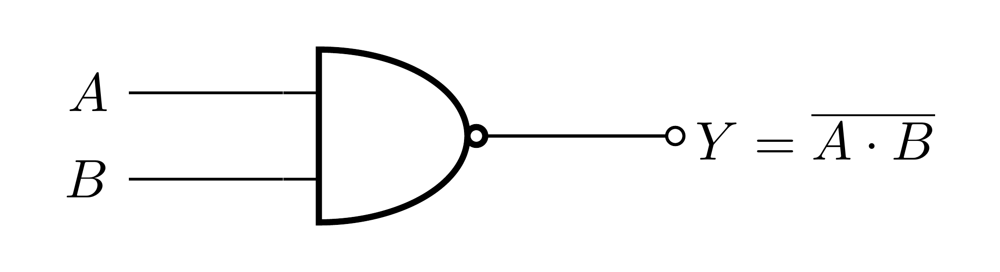
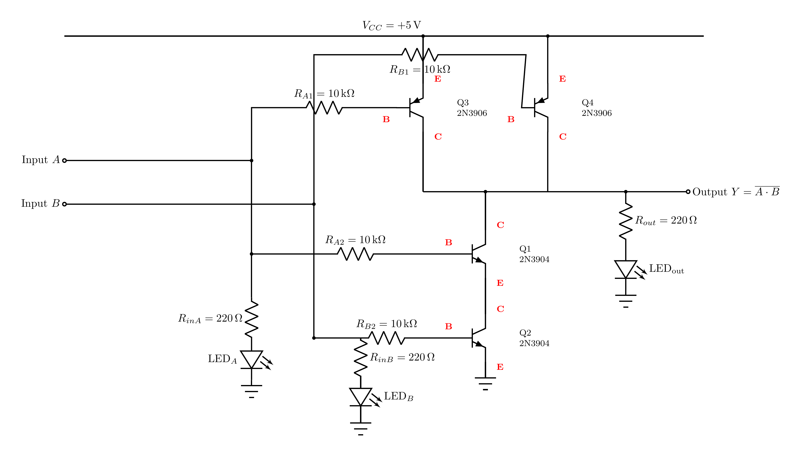
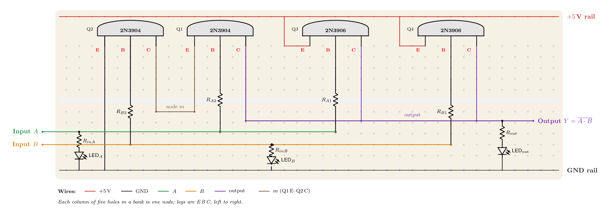

# NAND Gate

A NAND gate outputs `0` **only when both inputs are `1`**; otherwise it outputs `1`. It is the
inverse of AND, and is a *universal* gate: any logic circuit can be built from NAND gates alone.

This version is a **complementary (CMOS-style) gate** — the same idea as the NOT gate, extended
to two inputs. The output is **actively driven** almost rail-to-rail (`~4.8 V` / `~0.2 V`) and
draws almost no current at rest. Each input and the output carry an indicator LED.

### Symbol

The AND shape with a **bubble** on the output (the bubble = inversion).



### Truth table

| `A` | `B` | `Y` |
|:---:|:---:|:---:|
| 0 | 0 | 1 |
| 0 | 1 | 1 |
| 1 | 0 | 1 |
| 1 | 1 | **0** |

`Y = A NAND B = NOT(A · B)`

---

## What `0` and `1` really mean

`0` is the output **actively connected to ground (0 V)** through the conducting NPN transistors;
`1` is the output **actively connected to +5 V** through a conducting PNP. One side or the other
is always holding the output, so it is strong and never floats.

---

## How it is built

Four transistors, arranged exactly like a CMOS NAND:

> **Pull-down:** two **2N3904 (NPN)** in **series** (stacked) to ground.
> **Pull-up:** two **2N3906 (PNP)** in **parallel** to +5 V.



- **Pull-down (series NPN, Q1 + Q2):** the output can only be dragged to ground if **both** NPNs
  conduct — i.e. only when **A and B are both HIGH**.
- **Pull-up (parallel PNP, Q3 + Q4):** **either** PNP pulls the output up to `+5 V` whenever its
  input is LOW.
- Each input drives **one PNP and one NPN** through its **own base resistor** (so the
  transistors never fight — see the NOT gate's note on separate base resistors).

How it works:

- **Both A and B `1`:** both NPNs on (the series chain reaches ground), both PNPs off → output
  **LOW** → `0`.
- **Either input `0`:** that NPN is off (the series chain is broken) and that input's PNP is on
  → output **pulled HIGH** → `1`.

So `Y = NOT(A · B)`.

---

## Building it on a breadboard

Four transistors: **Q1, Q2 = 2N3904 (NPN)** and **Q3, Q4 = 2N3906 (PNP)**. All four share the
same TO-92 pinout — flat face toward you, legs down, **E B C** from left to right:


The wiring picture below is the breadboard build, every connection a **colour-coded jumper**
(see the legend). Each column of five holes in a bank is one node.



Connect the four transistors as follows:

| Transistor | E (emitter) | B (base) | C (collector) |
|:-----------|:------------|:---------|:--------------|
| **Q1 — 2N3904 (NPN, top of series)** | joined to Q2's collector (node *m*) | through R_A2 (10 kΩ) to Input A | **Output Y** |
| **Q2 — 2N3904 (NPN, bottom of series)** | **GND** | through R_B2 (10 kΩ) to Input B | joined to Q1's emitter (node *m*) |
| **Q3 — 2N3906 (PNP)** | **+5 V** | through R_A1 (10 kΩ) to Input A | **Output Y** |
| **Q4 — 2N3906 (PNP)** | **+5 V** | through R_B1 (10 kΩ) to Input B | **Output Y** |

The **Output Y** node is where Q1's collector and both PNP collectors meet. Then add the
indicators:

- **Input LEDs:** Input A → R_inA (220 Ω) → LED → GND; Input B → R_inB (220 Ω) → LED → GND.
- **Output LED:** Output Y → R_out (220 Ω) → LED → GND.

Reminder: `+5 V` and `GND` are **nodes**, not physical positions. If a result is wrong, the
usual causes are a transistor's legs in the wrong holes, or **mixing up the 2N3904 (NPN) and
2N3906 (PNP)** — they look identical, so mark them and re-check **E B C** against the pinout.

Quick test: Output is GND only when both inputs are +5 V; otherwise it is +5 V.

---

## Components

### Transistors: 2 × 2N3904 (NPN) + 2 × 2N3906 (PNP)

The 2N3904 and 2N3906 are a **complementary pair** — same TO-92 package, same **E B C** pinout,
opposite polarity. The NPNs do the series pull-down; the PNPs do the parallel pull-up.

- **Key ratings:** V_CE(O) ≈ **40 V** max, I_C ≈ **200 mA** max, current gain *hFE* ≈ **100–300**.
- **Substitutes:** BC547 (NPN) + BC557 (PNP), or 2N2222 (NPN) + 2N2907 (PNP) — any matched pair.
  **Re-check the pinout.**

### Resistors

| Ref | Value | Job |
|:---:|:-----:|:----|
| R_A1, R_A2, R_B1, R_B2 | **10 kΩ** | **Base resistors**, one per transistor; each input drives its PNP and NPN through separate resistors. |
| R_inA, R_inB, R_out | **220 Ω** | **LED current limiters** (~13 mA). |

### LEDs (×3)

- Any standard indicator LED (forward voltage ≈ 1.8–2 V): one per input, one on the output.

### Power

- A **+5 V** supply rail and a common **GND** (0 V) reference.

---

## Standards and references

**Gate symbol.** The distinctive-shape symbol follows the ANSI/IEEE standard for logic graphic symbols:

- IEEE Std 91-1984 and 91a-1991, *Graphic Symbols for Logic Functions* ([standards.ieee.org](https://standards.ieee.org/ieee/91_91a/241/)). The distinctive shapes originate from US MIL-STD-806; the international equivalent is IEC 60617-12.
- Symbols and truth tables overview: *Logic gate*, Wikipedia ([wikipedia.org](https://en.wikipedia.org/wiki/Logic_gate)).

**Transistor circuit.** This NAND is a complementary CMOS-style gate — parallel PNP pull-up + series NPN pull-down, the bipolar analogue of the CMOS NAND:

- *CMOS NAND gate*, Wikipedia ([wikipedia.org](https://en.wikipedia.org/wiki/NAND_gate#CMOS)).
- *Push–pull / complementary output*, Wikipedia ([wikipedia.org](https://en.wikipedia.org/wiki/Push%E2%80%93pull_output)).
- P. Horowitz and W. Hill, *The Art of Electronics*, 3rd ed., Cambridge University Press, 2015.
- A. S. Sedra and K. C. Smith, *Microelectronic Circuits*, Oxford University Press.
- T. L. Floyd, *Digital Fundamentals*, Pearson.

**Transistor parts.** 2N3904 NPN, onsemi datasheet ([PDF](https://www.onsemi.com/pdf/datasheet/2n3904-d.pdf)). 2N3906 PNP, onsemi datasheet ([PDF](https://www.onsemi.com/pdf/datasheet/2n3906-d.pdf)).

---

## Regenerating the diagrams

```bash
pdflatex circuit.tex
pdflatex symbol.tex
pdflatex wiring.tex
pdftoppm -png -r 400 circuit.pdf images/circuit   # -> images/circuit-1.png
pdftoppm -png -r 400 symbol.pdf  images/symbol     # -> images/symbol-1.png
pdftoppm -png -r 400 wiring.pdf  images/wiring     # -> images/wiring-1.png
```

> Use `pdftoppm`, not `pdftocairo`, at high DPI the Cairo backend can garble the fonts.
